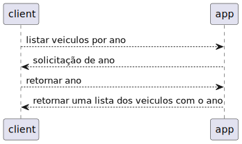

# Projeto Locadora de Carros

Projeto da disciplina **Laboratório de Programação Orientada a Objetos**

## Equipe
- Gabriel Batistuta Urbano Lopes (Turma C)
- Thiago Frank Almeida da Silva (Turma C)
- Jose Ivanilson Marinho da Silva (Turma C)

## Diagramas UML
*contéudos utilizados:*
- **plantuml** : *https://plantuml.com/*
- **curso de UML do canal Bóson Treinamentos** : *https://youtube.com/playlist?list=PLucm8g_ezqNqCRGHGHoacCo6N1bfN7hXZ*

**Class Diagram**

**Object Diagram**

**Activity Diagram**

**Usecase Diagram**

**Colaboration Diagram**

**Sequence Diagrams**

_os diagramas de sequência são separados por cada função do programa_

*functions*:
- ***cadastro de veiculos***

- ***consultar disponibilidade de veiculos***

- ***listar veiculos por marca***

- ***listar veiculos por modelo***

- ***listar veiculos por ano***

- ***cadastro de usuario***

- ***alugar_veiculo***

